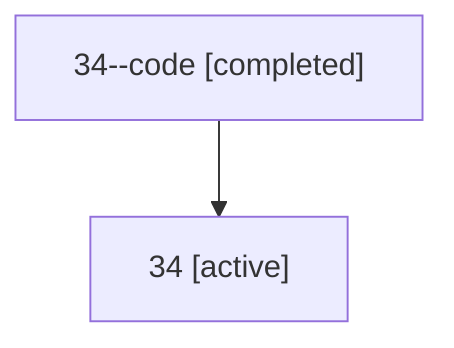

# Family: 34

[Agent Hoods](../README.md) / [bbugyi200](../users/bbugyi200/README.md) / [athena](../users/bbugyi200/machines/athena/README.md) / [34](../users/bbugyi200/machines/athena/hoods/34/README.md) / 34

Owner: `bbugyi200.athena` · Hood: `34` · Members: 2

## Lineage

The diagram is an optional enhancement; the ordered table below contains the same lineage in accessible text.

| Role | Agent | State | Model / provider | Timing | Commits | Prompt | Chat |
|---|---|---|---|---|---:|---|---|
| code | 34--code | completed | gpt-5.5 / codex | 2026-07-09T01:18:05.868928+00:00 | 0 | — | [Chat](../agents/bbugyi200.athena.34--code/chat.md) |
| root | 34 | active | opus / claude | 2026-07-09T01:05:10.886517+00:00 | [1](../agents/bbugyi200.athena.34/README.md#commits) | [Prompt](../agents/bbugyi200.athena.34/prompt.md) | [Chat](../agents/bbugyi200.athena.34/chat.md) |

## Commits

| Role | Repo | Commit | Subject | Committed |
|---|---|---|---|---|
| root | sase | [`d50c2e5`](https://github.com/sase-org/sase/commit/d50c2e52e706da04790419df19e6684b04354344) | feat(tui): aggregate agent output variables | 2026-07-08 21:30:53 EDT |
