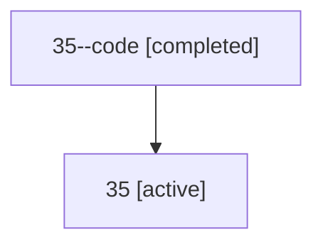

# Family: 35

[Agent Hoods](../README.md) / [bbugyi200](../users/bbugyi200/README.md) / [athena](../users/bbugyi200/machines/athena/README.md) / [35](../users/bbugyi200/machines/athena/hoods/35/README.md) / 35

Owner: `bbugyi200.athena` · Hood: `35` · Members: 2

## Lineage

The diagram is an optional enhancement; the ordered table below contains the same lineage in accessible text.

| Role | Agent | State | Model / provider | Timing | Commits | Prompt | Chat |
|---|---|---|---|---|---:|---|---|
| code | 35--code | completed | gpt-5.5 / codex | 2026-07-09T01:53:42.029856+00:00 | 0 | — | [Chat](../agents/bbugyi200.athena.35--code/chat.md) |
| root | 35 | active | gpt-5.5 / codex | 2026-07-09T01:49:54.421499+00:00 | [3](../agents/bbugyi200.athena.35/README.md#commits) | [Prompt](../agents/bbugyi200.athena.35/prompt.md) | [Chat](../agents/bbugyi200.athena.35/chat.md) |

## Commits

| Role | Commit | Subject | Committed (UTC) |
|---|---|---|---|
| root | [`59aa4b3`](https://github.com/sase-org/sase/commit/59aa4b3939769b4382e81ee9ce579c54d4cc55b6) | chore: Add SDD prompt and plan for home\_provider\_shim\_refs | 2026-06-06 14:02:21 |
| root | [`10ec1ef`](https://github.com/sase-org/sase/commit/10ec1ef2eb74353646c4110161f02e842b12f6df) | fix: use home provider shim refs for home roots | 2026-06-06 14:16:43 |
| root | [`992722f`](https://github.com/sase-org/sase/commit/992722f44d5330b9669b6166b95f55556b4ed40d) | fix(ace): distinguish prompt stash badge color | 2026-07-09 02:02:16 |
