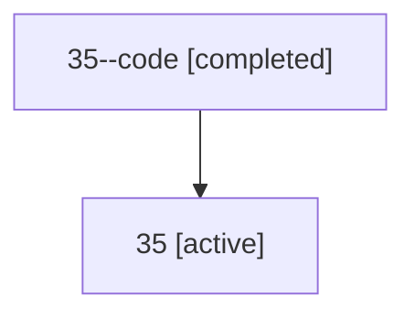

# Family: 35

Owner: `bbugyi200.athena` · Hood: `35` · Members: 2

## Lineage

The diagram is an optional enhancement; the ordered table below contains the same lineage in accessible text.

| Role | Agent | State | Model / provider | Timing | Commits | Prompt | Chat |
|---|---|---|---|---|---:|---|---|
| code | 35--code | completed | gpt-5.5 / codex | 2026-07-09T01:53:42.029856+00:00 | 0 | — | [Chat](../agents/bbugyi200.athena.35--code/chat.md) |
| root | 35 | active | gpt-5.5 / codex | 2026-07-09T01:49:54.421499+00:00 | 3 | [Prompt](../agents/bbugyi200.athena.35/prompt.md) | [Chat](../agents/bbugyi200.athena.35/chat.md) |
