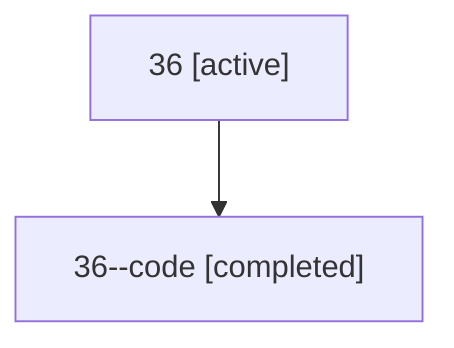

# Family: 36

Owner: `bbugyi200.athena` · Hood: `36` · Members: 2

## Lineage

The diagram is an optional enhancement; the ordered table below contains the same lineage in accessible text.

| Role | Agent | State | Model / provider | Timing | Commits | Prompt | Chat |
|---|---|---|---|---|---:|---|---|
| root | 36 | active | gpt-5.5 / codex | 2026-07-09T01:50:11.786120+00:00 | 3 | [Prompt](../agents/bbugyi200.athena.36/prompt.md) | [Chat](../agents/bbugyi200.athena.36/chat.md) |
| code | 36--code | completed | gpt-5.5 / codex | 2026-07-09T01:53:12.357372+00:00 | 0 | — | [Chat](../agents/bbugyi200.athena.36--code/chat.md) |
