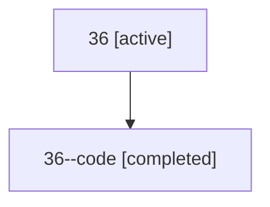

# Family: 36

[Agent Hoods](../README.md) / [bbugyi200](../users/bbugyi200/README.md) / [athena](../users/bbugyi200/machines/athena/README.md) / [36](../users/bbugyi200/machines/athena/hoods/36/README.md) / 36

Owner: `bbugyi200.athena` · Hood: `36` · Members: 2

## Lineage

The diagram is an optional enhancement; the ordered table below contains the same lineage in accessible text.

| Role | Agent | State | Model / provider | Timing | Commits | Prompt | Chat |
|---|---|---|---|---|---:|---|---|
| root | 36 | active | gpt-5.5 / codex | 2026-07-09T01:50:11.786120+00:00 | 0 | [Prompt](../agents/bbugyi200.athena.36/prompt.md) | [Chat](../agents/bbugyi200.athena.36/chat.md) |
| code | 36--code | completed | gpt-5.5 / codex | 2026-07-09T01:53:12.357372+00:00 | [1](../agents/bbugyi200.athena.36--code/README.md#commits) | — | [Chat](../agents/bbugyi200.athena.36--code/chat.md) |

## Commits

| Role | Repo | Commit | Subject | Committed |
|---|---|---|---|---|
| — | sase | [`e8dbf1c`](https://github.com/sase-org/sase/commit/e8dbf1cdb78ac26d5123e379980d4ad8d7027d12) | chore: Add SDD prompt and plan for wait\_family\_handoff | 2026-06-06 10:50:00 EDT |
| — | sase | [`aaf3ec8`](https://github.com/sase-org/sase/commit/aaf3ec8a7d319efbcf3bc14a72805c5a757d1cdd) | fix: resolve completed plan handoff wait deps | 2026-06-06 10:59:13 EDT |
| code | sase | [`dff80f1`](https://github.com/sase-org/sase/commit/dff80f129e7181036a2b70c0e0efb282bbb39961) | fix(plugin): use sase--plugin catalog topic | 2026-07-08 22:04:35 EDT |
