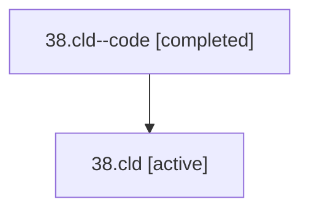

# Family: 38.cld

[Agent Hoods](../README.md) / [bbugyi200](../users/bbugyi200/README.md) / [athena](../users/bbugyi200/machines/athena/README.md) / [38](../users/bbugyi200/machines/athena/hoods/38/README.md) / 38.cld

Owner: `bbugyi200.athena` · Hood: `38` · Members: 2

## Lineage

The diagram is an optional enhancement; the ordered table below contains the same lineage in accessible text.

| Role | Agent | State | Model / provider | Timing | Commits | Prompt | Chat |
|---|---|---|---|---|---:|---|---|
| code | 38.cld--code | completed | gpt-5.5 / codex | 2026-07-09T02:43:05.274349+00:00 | [1](../agents/bbugyi200.athena.38.cld--code/README.md#commits) | — | [Chat](../agents/bbugyi200.athena.38.cld--code/chat.md) |
| root | 38.cld | active | opus / claude | 2026-07-09T02:25:28.377914+00:00 | [1](../agents/bbugyi200.athena.38.cld/README.md#commits) | [Prompt](../agents/bbugyi200.athena.38.cld/prompt.md) | [Chat](../agents/bbugyi200.athena.38.cld/chat.md) |

## Commits

| Role | Repo | Commit | Subject | Committed (UTC) |
|---|---|---|---|---|
| code | sase | [`b38c1b2`](https://github.com/sase-org/sase/commit/b38c1b262cb3da46385d3a8590463413406a5d6c) | fix: avoid stale agents tab diff fallback | 2026-07-09 02:55:57 |
| root | sase | [`b38c1b2`](https://github.com/sase-org/sase/commit/b38c1b262cb3da46385d3a8590463413406a5d6c) | fix: avoid stale agents tab diff fallback | 2026-07-09 02:55:57 |

## Neighbors

| Agent | Relation | State |
|---|---|---|
| [38.cdx](../agents/bbugyi200.athena.38.cdx/README.md) | 38 hood | active |
