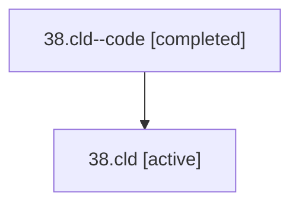

# Family: 38.cld

Owner: `bbugyi200.athena` · Hood: `38` · Members: 2

## Lineage

The diagram is an optional enhancement; the ordered table below contains the same lineage in accessible text.

| Role | Agent | State | Model / provider | Timing | Commits | Prompt | Chat |
|---|---|---|---|---|---:|---|---|
| code | 38.cld--code | completed | gpt-5.5 / codex | 2026-07-09T02:43:05.274349+00:00 | 1 | — | [Chat](../agents/bbugyi200.athena.38.cld--code/chat.md) |
| root | 38.cld | active | opus / claude | 2026-07-09T02:25:28.377914+00:00 | 1 | [Prompt](../agents/bbugyi200.athena.38.cld/prompt.md) | [Chat](../agents/bbugyi200.athena.38.cld/chat.md) |
