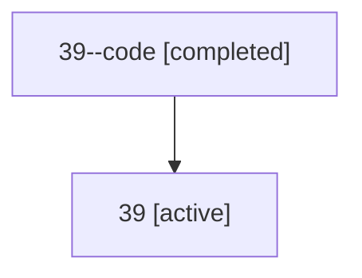

# Family: 39

[Agent Hoods](../README.md) / [bbugyi200](../users/bbugyi200/README.md) / [athena](../users/bbugyi200/machines/athena/README.md) / [39](../users/bbugyi200/machines/athena/hoods/39/README.md) / 39

Owner: `bbugyi200.athena` · Hood: `39` · Members: 2

## Lineage

The diagram is an optional enhancement; the ordered table below contains the same lineage in accessible text.

| Role | Agent | State | Model / provider | Timing | Commits | Prompt | Chat |
|---|---|---|---|---|---:|---|---|
| code | 39--code | completed | gpt-5.5 / codex | 2026-07-09T03:02:44.739196+00:00 | [1](../agents/bbugyi200.athena.39--code/README.md#commits) | — | [Chat](../agents/bbugyi200.athena.39--code/chat.md) |
| root | 39 | active | opus / claude | 2026-07-09T02:49:12.158381+00:00 | 0 | [Prompt](../agents/bbugyi200.athena.39/prompt.md) | [Chat](../agents/bbugyi200.athena.39/chat.md) |

## Commits

| Role | Repo | Commit | Subject | Committed |
|---|---|---|---|---|
| code | sase | [`47899b7`](https://github.com/sase-org/sase/commit/47899b7a15d70fe8e62d421e9f3a831b8f04ea06) | fix(beads): route separate SDD writes to workspace clone | 2026-07-08 23:13:39 EDT |
