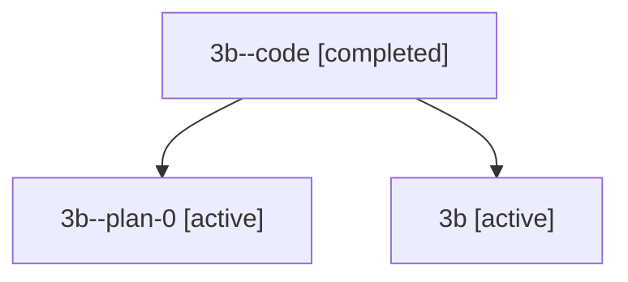

# Family: 3b

[Agent Hoods](../README.md) / [bbugyi200](../users/bbugyi200/README.md) / [athena](../users/bbugyi200/machines/athena/README.md) / [3b](../users/bbugyi200/machines/athena/hoods/3b/README.md) / 3b

Owner: `bbugyi200.athena` · Hood: `3b` · Members: 3

## Lineage

The diagram is an optional enhancement; the ordered table below contains the same lineage in accessible text.

| Role | Agent | State | Model / provider | Timing | Commits | Prompt | Chat |
|---|---|---|---|---|---:|---|---|
| code | 3b--code | completed | gpt-5.5 / codex | 2026-07-09T05:02:00.609101+00:00 | 0 | — | [Chat](../agents/bbugyi200.athena.3b--code/chat.md) |
| plan-0 | 3b--plan-0 | active | opus / claude | 2026-07-09T04:40:27.447792+00:00 | 0 | — | [Chat](../agents/bbugyi200.athena.3b--plan-0/chat.md) |
| root | 3b | active | opus / claude | 2026-07-09T04:24:46.525202+00:00 | [3](../agents/bbugyi200.athena.3b/README.md#commits) | [Prompt](../agents/bbugyi200.athena.3b/prompt.md) | [Chat](../agents/bbugyi200.athena.3b/chat.md) |

## Commits

| Role | Repo | Commit | Subject | Committed (UTC) |
|---|---|---|---|---|
| root | sase | [`e76d34c`](https://github.com/sase-org/sase/commit/e76d34cc37ad6a1eb8a5f0afbac42bd26c8523b3) | chore: Add SDD prompt and plan for prompt\_completion\_project\_root | 2026-06-06 18:17:25 |
| root | sase | [`f088603`](https://github.com/sase-org/sase/commit/f0886038a85815b2ec1132ed63f0fbdeb3f2f4e1) | feat: resolve prompt path completions from project refs | 2026-06-06 18:33:54 |
| root | sase | [`13b2768`](https://github.com/sase-org/sase/commit/13b276879e1f80dee2ad2aac31479e4ad06adc28) | ci: clone SDD companion in lint job | 2026-07-09 05:07:50 |

## Neighbors

| Agent | Relation | State |
|---|---|---|
| [3b.f1](../agents/bbugyi200.athena.3b.f1/README.md) | descendant | active |
