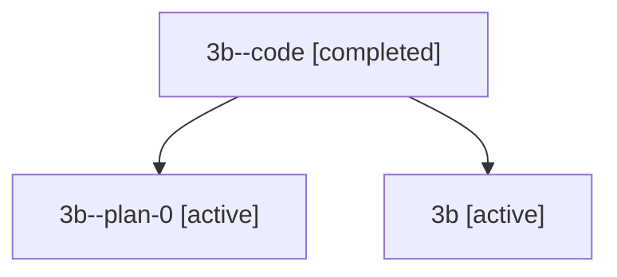

# Family: 3b

Owner: `bbugyi200.athena` · Hood: `3b` · Members: 3

## Lineage

The diagram is an optional enhancement; the ordered table below contains the same lineage in accessible text.

| Role | Agent | State | Model / provider | Timing | Commits | Prompt | Chat |
|---|---|---|---|---|---:|---|---|
| code | 3b--code | completed | gpt-5.5 / codex | 2026-07-09T05:02:00.609101+00:00 | 0 | — | [Chat](../agents/bbugyi200.athena.3b--code/chat.md) |
| plan-0 | 3b--plan-0 | active | opus / claude | 2026-07-09T04:40:27.447792+00:00 | 0 | — | [Chat](../agents/bbugyi200.athena.3b--plan-0/chat.md) |
| root | 3b | active | opus / claude | 2026-07-09T04:24:46.525202+00:00 | 3 | [Prompt](../agents/bbugyi200.athena.3b/prompt.md) | [Chat](../agents/bbugyi200.athena.3b/chat.md) |
