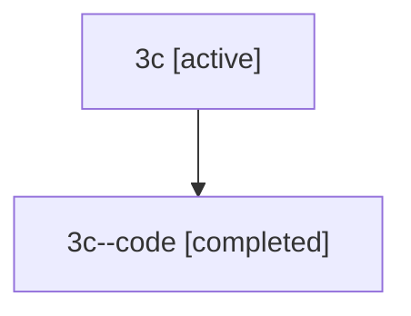

# Family: 3c

[Agent Hoods](../README.md) / [bbugyi200](../users/bbugyi200/README.md) / [athena](../users/bbugyi200/machines/athena/README.md) / [3c](../users/bbugyi200/machines/athena/hoods/3c/README.md) / 3c

Owner: `bbugyi200.athena` · Hood: `3c` · Members: 2

## Lineage

The diagram is an optional enhancement; the ordered table below contains the same lineage in accessible text.

| Role | Agent | State | Model / provider | Timing | Commits | Prompt | Chat |
|---|---|---|---|---|---:|---|---|
| root | 3c | active | gpt-5.5 / codex | 2026-07-09T05:03:58.746747+00:00 | [3](../agents/bbugyi200.athena.3c/README.md#commits) | [Prompt](../agents/bbugyi200.athena.3c/prompt.md) | [Chat](../agents/bbugyi200.athena.3c/chat.md) |
| code | 3c--code | completed | gpt-5.5 / codex | 2026-07-09T05:08:33.580402+00:00 | 0 | — | [Chat](../agents/bbugyi200.athena.3c--code/chat.md) |

## Commits

| Role | Commit | Subject | Committed (UTC) |
|---|---|---|---|
| root | [`9d0d238`](https://github.com/sase-org/sase/commit/9d0d238aa86f036c3590c5a9e038282e5cb4edec) | chore: Add SDD prompt and plan for remove\_origin\_story\_reindex\_blog | 2026-06-06 20:00:01 |
| root | [`8674c13`](https://github.com/sase-org/sase/commit/8674c1303719ec86db863e7644836340d743ac39) | chore: reindex SASE blog series | 2026-06-06 20:09:14 |
| root | [`e9473ca`](https://github.com/sase-org/sase/commit/e9473ca007b578df53ca7f7f4e1d515ccaa1d34c) | feat: include VCS tags in plan approval notifications | 2026-07-09 05:21:32 |

## Neighbors

| Agent | Relation | State |
|---|---|---|
| [3c.f1](../agents/bbugyi200.athena.3c.f1/README.md) | descendant | completed |
