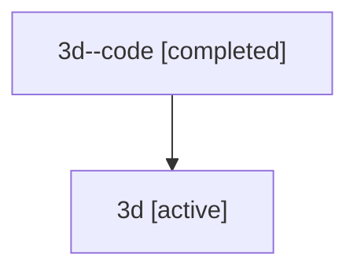

# Family: 3d

[Agent Hoods](../README.md) / [bbugyi200](../users/bbugyi200/README.md) / [athena](../users/bbugyi200/machines/athena/README.md) / [3d](../users/bbugyi200/machines/athena/hoods/3d/README.md) / 3d

Owner: `bbugyi200.athena` · Hood: `3d` · Members: 2

## Lineage

The diagram is an optional enhancement; the ordered table below contains the same lineage in accessible text.

| Role | Agent | State | Model / provider | Timing | Commits | Prompt | Chat |
|---|---|---|---|---|---:|---|---|
| code | 3d--code | completed | gpt-5.5 / codex | 2026-07-09T06:30:04.716069+00:00 | 0 | — | [Chat](../agents/bbugyi200.athena.3d--code/chat.md) |
| root | 3d | active | gpt-5.5 / codex | 2026-07-09T06:27:31.271009+00:00 | [2](../agents/bbugyi200.athena.3d/README.md#commits) | [Prompt](../agents/bbugyi200.athena.3d/prompt.md) | [Chat](../agents/bbugyi200.athena.3d/chat.md) |

## Commits

| Role | Repo | Commit | Subject | Committed (UTC) |
|---|---|---|---|---|
| root | sase | [`dfd4675`](https://github.com/sase-org/sase/commit/dfd4675cc023acb9d9b86b29fce78e6f5102c391) | chore: Add SDD prompt and plan for rename\_cls\_tab\_to\_prs | 2026-06-07 10:06:28 |
| root | sase | [`75ff288`](https://github.com/sase-org/sase/commit/75ff2882000a1df2b7f25eefb56297d87b7b2ea3) | feat: rename ACE CL labels to PRs | 2026-06-07 10:24:59 |
