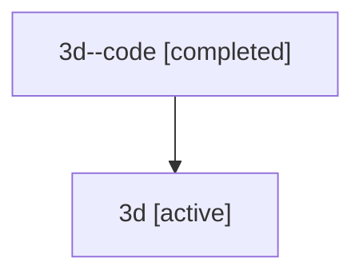

# Family: 3d

Owner: `bbugyi200.athena` · Hood: `3d` · Members: 2

## Lineage

The diagram is an optional enhancement; the ordered table below contains the same lineage in accessible text.

| Role | Agent | State | Model / provider | Timing | Commits | Prompt | Chat |
|---|---|---|---|---|---:|---|---|
| code | 3d--code | completed | gpt-5.5 / codex | 2026-07-09T06:30:04.716069+00:00 | 0 | — | [Chat](../agents/bbugyi200.athena.3d--code/chat.md) |
| root | 3d | active | gpt-5.5 / codex | 2026-07-09T06:27:31.271009+00:00 | 2 | [Prompt](../agents/bbugyi200.athena.3d/prompt.md) | [Chat](../agents/bbugyi200.athena.3d/chat.md) |
