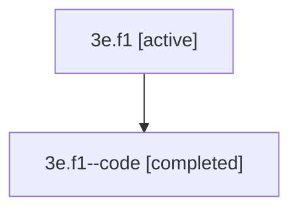

# Family: 3e.f1

Owner: `bbugyi200.athena` · Hood: `3e` · Members: 2

## Lineage

The diagram is an optional enhancement; the ordered table below contains the same lineage in accessible text.

| Role | Agent | State | Model / provider | Timing | Commits | Prompt | Chat |
|---|---|---|---|---|---:|---|---|
| root | 3e.f1 | active | gpt-5.5 / codex | 2026-07-09T06:52:46.659518+00:00 | 1 | [Prompt](../agents/bbugyi200.athena.3e.f1/prompt.md) | [Chat](../agents/bbugyi200.athena.3e.f1/chat.md) |
| code | 3e.f1--code | completed | gpt-5.5 / codex | 2026-07-09T07:10:57.208771+00:00 | 0 | — | [Chat](../agents/bbugyi200.athena.3e.f1--code/chat.md) |
