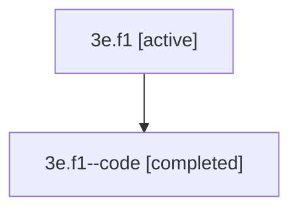

# Family: 3e.f1

[Agent Hoods](../README.md) / [bbugyi200](../users/bbugyi200/README.md) / [athena](../users/bbugyi200/machines/athena/README.md) / [3e](../users/bbugyi200/machines/athena/hoods/3e/README.md) / 3e.f1

Owner: `bbugyi200.athena` · Hood: `3e` · Members: 2

## Lineage

The diagram is an optional enhancement; the ordered table below contains the same lineage in accessible text.

| Role | Agent | State | Model / provider | Timing | Commits | Prompt | Chat |
|---|---|---|---|---|---:|---|---|
| root | 3e.f1 | active | gpt-5.5 / codex | 2026-07-09T06:52:46.659518+00:00 | 0 | [Prompt](../agents/bbugyi200.athena.3e.f1/prompt.md) | [Chat](../agents/bbugyi200.athena.3e.f1/chat.md) |
| code | 3e.f1--code | completed | gpt-5.5 / codex | 2026-07-09T07:10:57.208771+00:00 | [1](../agents/bbugyi200.athena.3e.f1--code/README.md#commits) | — | [Chat](../agents/bbugyi200.athena.3e.f1--code/chat.md) |

## Commits

| Role | Repo | Commit | Subject | Committed |
|---|---|---|---|---|
| code | sase | [`d3da6c9`](https://github.com/sase-org/sase/commit/d3da6c93b789a6e9f443ca7986a26969be4261fb) | fix(sdd): handle legacy stores during companion init | 2026-07-09 03:31:45 EDT |

## Neighbors

| Agent | Relation | State |
|---|---|---|
| [3e](bbugyi200.athena.3e.md) (family · 2) | ancestor | active 1, completed 1 |
