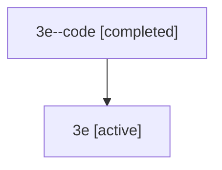

# Family: 3e

[Agent Hoods](../README.md) / [bbugyi200](../users/bbugyi200/README.md) / [athena](../users/bbugyi200/machines/athena/README.md) / [3e](../users/bbugyi200/machines/athena/hoods/3e/README.md) / 3e

Owner: `bbugyi200.athena` · Hood: `3e` · Members: 2

## Lineage

The diagram is an optional enhancement; the ordered table below contains the same lineage in accessible text.

| Role | Agent | State | Model / provider | Timing | Commits | Prompt | Chat |
|---|---|---|---|---|---:|---|---|
| code | 3e--code | completed | gpt-5.5 / codex | 2026-07-09T06:39:15.998540+00:00 | [1](../agents/bbugyi200.athena.3e--code/README.md#commits) | — | [Chat](../agents/bbugyi200.athena.3e--code/chat.md) |
| root | 3e | active | gpt-5.5 / codex | 2026-07-09T06:33:01.253003+00:00 | 0 | [Prompt](../agents/bbugyi200.athena.3e/prompt.md) | [Chat](../agents/bbugyi200.athena.3e/chat.md) |

## Commits

| Role | Repo | Commit | Subject | Committed |
|---|---|---|---|---|
| code | sase | [`16b5602`](https://github.com/sase-org/sase/commit/16b56024a2ebe7d2c7c008b849c8711afacbdfbd) | chore: update SDD companion repository name | 2026-07-09 02:51:45 EDT |

## Neighbors

| Agent | Relation | State |
|---|---|---|
| [3e.f1](bbugyi200.athena.3e.f1.md) (family · 2) | descendant | active 1, completed 1 |
