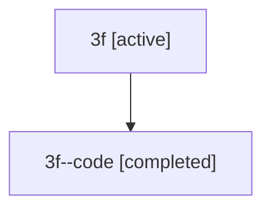

# Family: 3f

[Agent Hoods](../README.md) / [bbugyi200](../users/bbugyi200/README.md) / [athena](../users/bbugyi200/machines/athena/README.md) / [3f](../users/bbugyi200/machines/athena/hoods/3f/README.md) / 3f

Owner: `bbugyi200.athena` · Hood: `3f` · Members: 2

## Lineage

The diagram is an optional enhancement; the ordered table below contains the same lineage in accessible text.

| Role | Agent | State | Model / provider | Timing | Commits | Prompt | Chat |
|---|---|---|---|---|---:|---|---|
| root | 3f | active | opus / claude | 2026-07-09T06:50:06.473160+00:00 | 0 | [Prompt](../agents/bbugyi200.athena.3f/prompt.md) | [Chat](../agents/bbugyi200.athena.3f/chat.md) |
| code | 3f--code | completed | gpt-5.5 / codex | 2026-07-09T07:03:32.121444+00:00 | [1](../agents/bbugyi200.athena.3f--code/README.md#commits) | — | [Chat](../agents/bbugyi200.athena.3f--code/chat.md) |

## Commits

| Role | Repo | Commit | Subject | Committed |
|---|---|---|---|---|
| code | sase | [`649674e`](https://github.com/sase-org/sase/commit/649674e09ea242e5278dad9755db73cbc92ec889) | feat: add shared agent list projection | 2026-07-09 03:39:53 EDT |
