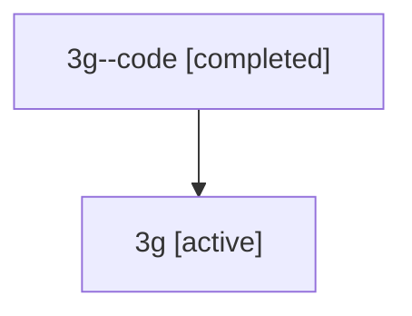

# Family: 3g

[Agent Hoods](../README.md) / [bbugyi200](../users/bbugyi200/README.md) / [athena](../users/bbugyi200/machines/athena/README.md) / [3g](../users/bbugyi200/machines/athena/hoods/3g/README.md) / 3g

Owner: `bbugyi200.athena` · Hood: `3g` · Members: 2

## Lineage

The diagram is an optional enhancement; the ordered table below contains the same lineage in accessible text.

| Role | Agent | State | Model / provider | Timing | Commits | Prompt | Chat |
|---|---|---|---|---|---:|---|---|
| code | 3g--code | completed | gpt-5.5 / codex | 2026-07-09T14:53:32.244220+00:00 | 0 | — | [Chat](../agents/bbugyi200.athena.3g--code/chat.md) |
| root | 3g | active | gpt-5.5 / codex | 2026-07-09T14:43:07.965610+00:00 | [1](../agents/bbugyi200.athena.3g/README.md#commits) | [Prompt](../agents/bbugyi200.athena.3g/prompt.md) | [Chat](../agents/bbugyi200.athena.3g/chat.md) |

## Commits

| Role | Repo | Commit | Subject | Committed |
|---|---|---|---|---|
| root | sase | [`eb2338f`](https://github.com/sase-org/sase/commit/eb2338f83093f917f9ae4e01b107580b412ccf4e) | feat!: remove stale agent status grouping helper | 2026-07-09 10:58:56 EDT |
