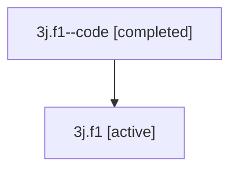

# Family: 3j.f1

[Agent Hoods](../README.md) / [bbugyi200](../users/bbugyi200/README.md) / [athena](../users/bbugyi200/machines/athena/README.md) / [3j](../users/bbugyi200/machines/athena/hoods/3j/README.md) / 3j.f1

Owner: `bbugyi200.athena` · Hood: `3j` · Members: 2

## Lineage

The diagram is an optional enhancement; the ordered table below contains the same lineage in accessible text.

| Role | Agent | State | Model / provider | Timing | Commits | Prompt | Chat |
|---|---|---|---|---|---:|---|---|
| code | 3j.f1--code | completed | gpt-5.5 / codex | 2026-07-09T16:04:22.723615+00:00 | 0 | — | [Chat](../agents/bbugyi200.athena.3j.f1--code/chat.md) |
| root | 3j.f1 | active | opus / claude | 2026-07-09T16:01:16.057083+00:00 | [1](../agents/bbugyi200.athena.3j.f1/README.md#commits) | [Prompt](../agents/bbugyi200.athena.3j.f1/prompt.md) | [Chat](../agents/bbugyi200.athena.3j.f1/chat.md) |

## Commits

| Role | Repo | Commit | Subject | Committed |
|---|---|---|---|---|
| root | sase | [`1514023`](https://github.com/sase-org/sase/commit/151402345dc3dcec1145d0e070a5d2b9ca9e65ae) | docs: tighten pyvision memory guidance | 2026-07-09 12:10:36 EDT |

## Neighbors

| Agent | Relation | State |
|---|---|---|
| [3j](bbugyi200.athena.3j.md) (family · 2) | ancestor | active 1, completed 1 |
