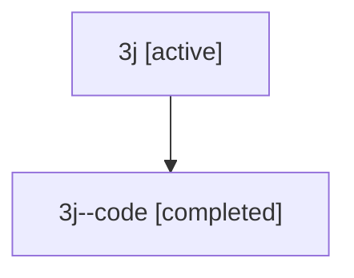

# Family: 3j

Owner: `bbugyi200.athena` · Hood: `3j` · Members: 2

## Lineage

The diagram is an optional enhancement; the ordered table below contains the same lineage in accessible text.

| Role | Agent | State | Model / provider | Timing | Commits | Prompt | Chat |
|---|---|---|---|---|---:|---|---|
| root | 3j | active | opus / claude | 2026-07-09T15:34:13.814614+00:00 | 1 | [Prompt](../agents/bbugyi200.athena.3j/prompt.md) | [Chat](../agents/bbugyi200.athena.3j/chat.md) |
| code | 3j--code | completed | gpt-5.5 / codex | 2026-07-09T15:40:10.111260+00:00 | 0 | — | [Chat](../agents/bbugyi200.athena.3j--code/chat.md) |
