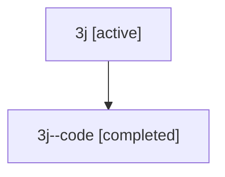

# Family: 3j

[Agent Hoods](../README.md) / [bbugyi200](../users/bbugyi200/README.md) / [athena](../users/bbugyi200/machines/athena/README.md) / [3j](../users/bbugyi200/machines/athena/hoods/3j/README.md) / 3j

Owner: `bbugyi200.athena` · Hood: `3j` · Members: 2

## Lineage

The diagram is an optional enhancement; the ordered table below contains the same lineage in accessible text.

| Role | Agent | State | Model / provider | Timing | Commits | Prompt | Chat |
|---|---|---|---|---|---:|---|---|
| root | 3j | active | opus / claude | 2026-07-09T15:34:13.814614+00:00 | 0 | [Prompt](../agents/bbugyi200.athena.3j/prompt.md) | [Chat](../agents/bbugyi200.athena.3j/chat.md) |
| code | 3j--code | completed | gpt-5.5 / codex | 2026-07-09T15:40:10.111260+00:00 | [1](../agents/bbugyi200.athena.3j--code/README.md#commits) | — | [Chat](../agents/bbugyi200.athena.3j--code/chat.md) |

## Commits

| Role | Repo | Commit | Subject | Committed |
|---|---|---|---|---|
| code | sase | [`e137094`](https://github.com/sase-org/sase/commit/e137094bcd23e30110a7f4be972a28e48a138213) | docs: add pyvision memory note | 2026-07-09 15:48:06 UTC |

## Neighbors

| Agent | Relation | State |
|---|---|---|
| [3j.f1](bbugyi200.athena.3j.f1.md) (family · 2) | descendant | active 1, completed 1 |
