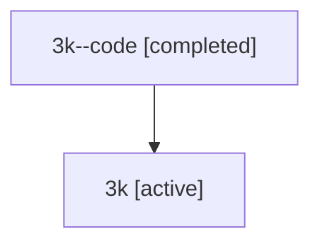

# Family: 3k

[Agent Hoods](../README.md) / [bbugyi200](../users/bbugyi200/README.md) / [athena](../users/bbugyi200/machines/athena/README.md) / [3k](../users/bbugyi200/machines/athena/hoods/3k/README.md) / 3k

Owner: `bbugyi200.athena` · Hood: `3k` · Members: 2

## Lineage

The diagram is an optional enhancement; the ordered table below contains the same lineage in accessible text.

| Role | Agent | State | Model / provider | Timing | Commits | Prompt | Chat |
|---|---|---|---|---|---:|---|---|
| code | 3k--code | completed | gpt-5.5 / codex | 2026-07-09T16:32:00.444426+00:00 | [1](../agents/bbugyi200.athena.3k--code/README.md#commits) | — | [Chat](../agents/bbugyi200.athena.3k--code/chat.md) |
| root | 3k | active | gpt-5.5 / codex | 2026-07-09T16:24:44.829664+00:00 | 0 | [Prompt](../agents/bbugyi200.athena.3k/prompt.md) | [Chat](../agents/bbugyi200.athena.3k/chat.md) |

## Commits

| Role | Repo | Commit | Subject | Committed |
|---|---|---|---|---|
| code | sase | [`52c99ca`](https://github.com/sase-org/sase/commit/52c99ca5de304fdc673f0ba76002a260321f5bd0) | fix(tui): defer update restart for background tasks | 2026-07-09 16:40:20 UTC |

## Neighbors

| Agent | Relation | State |
|---|---|---|
| [3k.cld](../agents/bbugyi200.athena.3k.cld/README.md) | descendant | completed |
