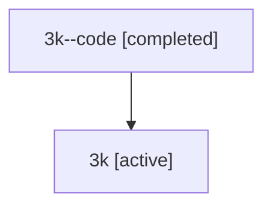

# Family: 3k

Owner: `bbugyi200.athena` · Hood: `3k` · Members: 2

## Lineage

The diagram is an optional enhancement; the ordered table below contains the same lineage in accessible text.

| Role | Agent | State | Model / provider | Timing | Commits | Prompt | Chat |
|---|---|---|---|---|---:|---|---|
| code | 3k--code | completed | gpt-5.5 / codex | 2026-07-09T16:32:00.444426+00:00 | 0 | — | [Chat](../agents/bbugyi200.athena.3k--code/chat.md) |
| root | 3k | active | gpt-5.5 / codex | 2026-07-09T16:24:44.829664+00:00 | 1 | [Prompt](../agents/bbugyi200.athena.3k/prompt.md) | [Chat](../agents/bbugyi200.athena.3k/chat.md) |
