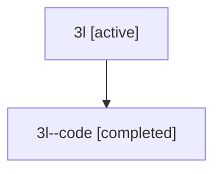

# Family: 3l

[Agent Hoods](../README.md) / [bbugyi200](../users/bbugyi200/README.md) / [athena](../users/bbugyi200/machines/athena/README.md) / [3l](../users/bbugyi200/machines/athena/hoods/3l/README.md) / 3l

Owner: `bbugyi200.athena` · Hood: `3l` · Members: 2

## Lineage

The diagram is an optional enhancement; the ordered table below contains the same lineage in accessible text.

| Role | Agent | State | Model / provider | Timing | Commits | Prompt | Chat |
|---|---|---|---|---|---:|---|---|
| root | 3l | active | opus / claude | 2026-07-09T16:26:43.510225+00:00 | 0 | [Prompt](../agents/bbugyi200.athena.3l/prompt.md) | [Chat](../agents/bbugyi200.athena.3l/chat.md) |
| code | 3l--code | completed | gpt-5.5 / codex | 2026-07-09T16:46:21.963611+00:00 | [1](../agents/bbugyi200.athena.3l--code/README.md#commits) | — | [Chat](../agents/bbugyi200.athena.3l--code/chat.md) |

## Commits

| Role | Repo | Commit | Subject | Committed |
|---|---|---|---|---|
| code | sase | [`f1f5324`](https://github.com/sase-org/sase/commit/f1f5324e21cd6fa25f29dd47af0c672c5de6269e) | fix: suppress refresh docs marker notification | 2026-07-09 12:51:39 EDT |
