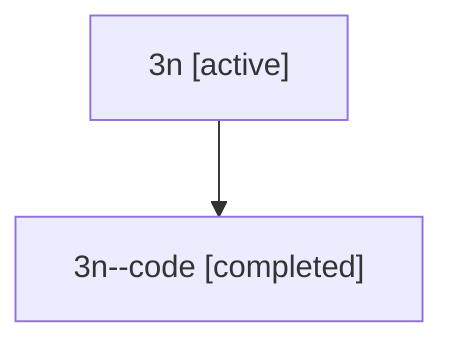

# Family: 3n

[Agent Hoods](../README.md) / [bbugyi200](../users/bbugyi200/README.md) / [athena](../users/bbugyi200/machines/athena/README.md) / [3n](../users/bbugyi200/machines/athena/hoods/3n/README.md) / 3n

Owner: `bbugyi200.athena` · Hood: `3n` · Members: 2

## Lineage

The diagram is an optional enhancement; the ordered table below contains the same lineage in accessible text.

| Role | Agent | State | Model / provider | Timing | Commits | Prompt | Chat |
|---|---|---|---|---|---:|---|---|
| root | 3n | active | opus / claude | 2026-07-09T16:39:33.812084+00:00 | [1](../agents/bbugyi200.athena.3n/README.md#commits) | [Prompt](../agents/bbugyi200.athena.3n/prompt.md) | [Chat](../agents/bbugyi200.athena.3n/chat.md) |
| code | 3n--code | completed | gpt-5.5 / codex | 2026-07-09T16:46:36.979636+00:00 | [1](../agents/bbugyi200.athena.3n--code/README.md#commits) | — | [Chat](../agents/bbugyi200.athena.3n--code/chat.md) |

## Commits

| Role | Commit | Subject | Committed (UTC) |
|---|---|---|---|
| code | [`228b496`](https://github.com/sase-org/sase/commit/228b496e0e109962d8acb42a4af6e7b335394e7d) | fix(tui): handle control-byte prompt chords | 2026-07-09 16:54:30 |
| root | [`228b496`](https://github.com/sase-org/sase/commit/228b496e0e109962d8acb42a4af6e7b335394e7d) | fix(tui): handle control-byte prompt chords | 2026-07-09 16:54:30 |
