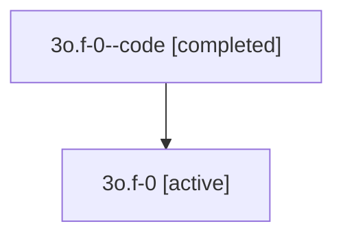

# Family: 3o.f-0

[Agent Hoods](../README.md) / [bbugyi200](../users/bbugyi200/README.md) / [athena](../users/bbugyi200/machines/athena/README.md) / [3o](../users/bbugyi200/machines/athena/hoods/3o/README.md) / 3o.f-0

Owner: `bbugyi200.athena` · Hood: `3o` · Members: 2

## Lineage

The diagram is an optional enhancement; the ordered table below contains the same lineage in accessible text.

| Role | Agent | State | Model / provider | Timing | Commits | Prompt | Chat |
|---|---|---|---|---|---:|---|---|
| code | 3o.f-0--code | completed | gpt-5.5 / codex | 2026-07-09T17:52:55.230154+00:00 | [1](../agents/bbugyi200.athena.3o.f-0--code/README.md#commits) | — | [Chat](../agents/bbugyi200.athena.3o.f-0--code/chat.md) |
| root | 3o.f-0 | active | gpt-5.5 / codex | 2026-07-09T17:49:36.668228+00:00 | 0 | [Prompt](../agents/bbugyi200.athena.3o.f-0/prompt.md) | [Chat](../agents/bbugyi200.athena.3o.f-0/chat.md) |

## Commits

| Role | Repo | Commit | Subject | Committed |
|---|---|---|---|---|
| code | sase | [`69e2d79`](https://github.com/sase-org/sase/commit/69e2d795cf3bd4f95b404b4106407629eff66c7e) | feat(tui): navigate selected commit views | 2026-07-09 14:05:08 EDT |

## Neighbors

| Agent | Relation | State |
|---|---|---|
| [3o](bbugyi200.athena.3o.md) (family · 2) | ancestor | active 1, completed 1 |
| [3o.f-0.f-0](../agents/bbugyi200.athena.3o.f-0.f-0/README.md) | descendant | active |
| [3o.f-0.f-1](../agents/bbugyi200.athena.3o.f-0.f-1/README.md) | descendant | active |
| [3o.w1](bbugyi200.athena.3o.w1.md) (family · 2) | 3o hood | active 1, completed 1 |
| [3o.w2](bbugyi200.athena.3o.w2.md) (family · 2) | 3o hood | active 1, completed 1 |
