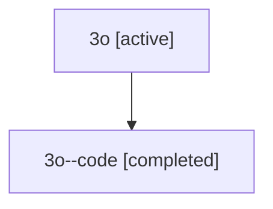

# Family: 3o

Owner: `bbugyi200.athena` · Hood: `3o` · Members: 2

## Lineage

The diagram is an optional enhancement; the ordered table below contains the same lineage in accessible text.

| Role | Agent | State | Model / provider | Timing | Commits | Prompt | Chat |
|---|---|---|---|---|---:|---|---|
| root | 3o | active | opus / claude | 2026-07-09T16:45:52.641182+00:00 | 1 | [Prompt](../agents/bbugyi200.athena.3o/prompt.md) | [Chat](../agents/bbugyi200.athena.3o/chat.md) |
| code | 3o--code | completed | gpt-5.5 / codex | 2026-07-09T16:57:02.546970+00:00 | 0 | — | [Chat](../agents/bbugyi200.athena.3o--code/chat.md) |
