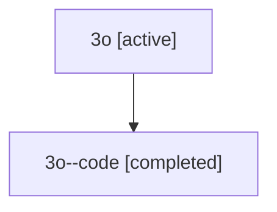

# Family: 3o

[Agent Hoods](../README.md) / [bbugyi200](../users/bbugyi200/README.md) / [athena](../users/bbugyi200/machines/athena/README.md) / [3o](../users/bbugyi200/machines/athena/hoods/3o/README.md) / 3o

Owner: `bbugyi200.athena` · Hood: `3o` · Members: 2

## Lineage

The diagram is an optional enhancement; the ordered table below contains the same lineage in accessible text.

| Role | Agent | State | Model / provider | Timing | Commits | Prompt | Chat |
|---|---|---|---|---|---:|---|---|
| root | 3o | active | opus / claude | 2026-07-09T16:45:52.641182+00:00 | [1](../agents/bbugyi200.athena.3o/README.md#commits) | [Prompt](../agents/bbugyi200.athena.3o/prompt.md) | [Chat](../agents/bbugyi200.athena.3o/chat.md) |
| code | 3o--code | completed | gpt-5.5 / codex | 2026-07-09T16:57:02.546970+00:00 | 0 | — | [Chat](../agents/bbugyi200.athena.3o--code/chat.md) |

## Commits

| Role | Commit | Subject | Committed (UTC) |
|---|---|---|---|
| root | [`cca9d50`](https://github.com/sase-org/sase/commit/cca9d500cd88751180efd0d6f47c0ab9b73e7902) | feat(tui): add commit hint viewer | 2026-07-09 17:22:24 |

## Neighbors

| Agent | Relation | State |
|---|---|---|
| [3o.f-0](bbugyi200.athena.3o.f-0.md) (family · 2) | descendant | active 1, completed 1 |
| [3o.f-0.f-0](../agents/bbugyi200.athena.3o.f-0.f-0/README.md) | descendant | active |
| [3o.f-0.f-1](../agents/bbugyi200.athena.3o.f-0.f-1/README.md) | descendant | active |
| [3o.w1](bbugyi200.athena.3o.w1.md) (family · 2) | descendant | active 1, completed 1 |
| [3o.w2](bbugyi200.athena.3o.w2.md) (family · 2) | descendant | active 1, completed 1 |
