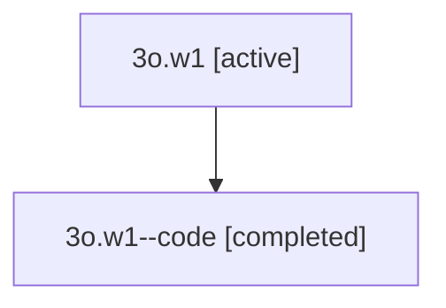

# Family: 3o.w1

[Agent Hoods](../README.md) / [bbugyi200](../users/bbugyi200/README.md) / [athena](../users/bbugyi200/machines/athena/README.md) / [3o](../users/bbugyi200/machines/athena/hoods/3o/README.md) / 3o.w1

Owner: `bbugyi200.athena` · Hood: `3o` · Members: 2

## Lineage

The diagram is an optional enhancement; the ordered table below contains the same lineage in accessible text.

| Role | Agent | State | Model / provider | Timing | Commits | Prompt | Chat |
|---|---|---|---|---|---:|---|---|
| root | 3o.w1 | active | gpt-5.5 / codex | 2026-07-09T17:22:56.544662+00:00 | 0 | [Prompt](../agents/bbugyi200.athena.3o.w1/prompt.md) | [Chat](../agents/bbugyi200.athena.3o.w1/chat.md) |
| code | 3o.w1--code | completed | gpt-5.5 / codex | 2026-07-09T17:27:03.918985+00:00 | [1](../agents/bbugyi200.athena.3o.w1--code/README.md#commits) | — | [Chat](../agents/bbugyi200.athena.3o.w1--code/chat.md) |

## Commits

| Role | Repo | Commit | Subject | Committed |
|---|---|---|---|---|
| code | sase | [`4330f6f`](https://github.com/sase-org/sase/commit/4330f6f2c92357d3204b930ba334003e4b386bae) | fix(tui): hide commit message bookkeeping deltas | 2026-07-09 17:35:26 UTC |

## Neighbors

| Agent | Relation | State |
|---|---|---|
| [3o](bbugyi200.athena.3o.md) (family · 2) | ancestor | active 1, completed 1 |
| [3o.f-0](bbugyi200.athena.3o.f-0.md) (family · 2) | 3o hood | active 1, completed 1 |
| [3o.f-0.f-0](../agents/bbugyi200.athena.3o.f-0.f-0/README.md) | 3o hood | active |
| [3o.f-0.f-1](../agents/bbugyi200.athena.3o.f-0.f-1/README.md) | 3o hood | active |
| [3o.w2](bbugyi200.athena.3o.w2.md) (family · 2) | 3o hood | active 1, completed 1 |
