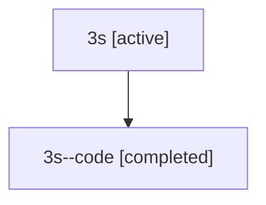

# Family: 3s

[Agent Hoods](../README.md) / [bbugyi200](../users/bbugyi200/README.md) / [athena](../users/bbugyi200/machines/athena/README.md) / [3s](../users/bbugyi200/machines/athena/hoods/3s/README.md) / 3s

Owner: `bbugyi200.athena` · Hood: `3s` · Members: 2

## Lineage

The diagram is an optional enhancement; the ordered table below contains the same lineage in accessible text.

| Role | Agent | State | Model / provider | Timing | Commits | Prompt | Chat |
|---|---|---|---|---|---:|---|---|
| root | 3s | active | gpt-5.5 / codex | 2026-07-09T17:11:37.720972+00:00 | [1](../agents/bbugyi200.athena.3s/README.md#commits) | [Prompt](../agents/bbugyi200.athena.3s/prompt.md) | [Chat](../agents/bbugyi200.athena.3s/chat.md) |
| code | 3s--code | completed | gpt-5.5 / codex | 2026-07-09T17:16:47.067022+00:00 | 0 | — | [Chat](../agents/bbugyi200.athena.3s--code/chat.md) |

## Commits

| Role | Commit | Subject | Committed (UTC) |
|---|---|---|---|
| root | [`6b51a9c`](https://github.com/sase-org/sase/commit/6b51a9c86114be04752652eb1cc9faff1d6a4c20) | feat(agent)!: allocate derived names through templates | 2026-07-09 17:40:03 |

## Neighbors

| Agent | Relation | State |
|---|---|---|
| [3s.cld](../agents/bbugyi200.athena.3s.cld/README.md) | descendant | dismissed |
