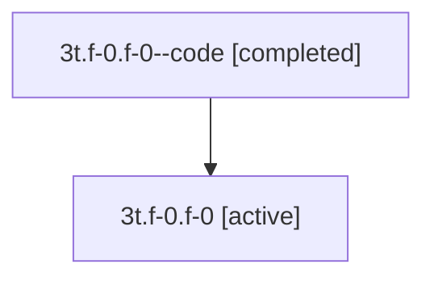

# Family: 3t.f-0.f-0

[Agent Hoods](../README.md) / [bbugyi200](../users/bbugyi200/README.md) / [athena](../users/bbugyi200/machines/athena/README.md) / [3t](../users/bbugyi200/machines/athena/hoods/3t/README.md) / 3t.f-0.f-0

Owner: `bbugyi200.athena` · Hood: `3t` · Members: 2

## Lineage

The diagram is an optional enhancement; the ordered table below contains the same lineage in accessible text.

| Role | Agent | State | Model / provider | Timing | Commits | Prompt | Chat |
|---|---|---|---|---|---:|---|---|
| code | 3t.f-0.f-0--code | completed | gpt-5.5 / codex | 2026-07-09T18:23:57.458483+00:00 | [1](../agents/bbugyi200.athena.3t.f-0.f-0--code/README.md#commits) | — | [Chat](../agents/bbugyi200.athena.3t.f-0.f-0--code/chat.md) |
| root | 3t.f-0.f-0 | active | gpt-5.5 / codex | 2026-07-09T18:19:31.616601+00:00 | 0 | [Prompt](../agents/bbugyi200.athena.3t.f-0.f-0/prompt.md) | [Chat](../agents/bbugyi200.athena.3t.f-0.f-0/chat.md) |

## Commits

| Role | Repo | Commit | Subject | Committed |
|---|---|---|---|---|
| code | sase | [`31b4d01`](https://github.com/sase-org/sase/commit/31b4d012e1c707ff832e0850d550cd67e5223b87) | feat(vcs): cache log fetches and show tags by default | 2026-07-09 14:40:10 EDT |

## Neighbors

| Agent | Relation | State |
|---|---|---|
| [3t.f-0](bbugyi200.athena.3t.f-0.md) (family · 2) | ancestor | active 1, completed 1 |
| [3t](bbugyi200.athena.3t.md) (family · 2) | ancestor | active 1, completed 1 |
