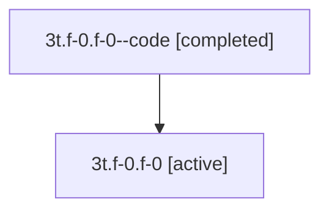

# Family: 3t.f-0.f-0

Owner: `bbugyi200.athena` · Hood: `3t` · Members: 2

## Lineage

The diagram is an optional enhancement; the ordered table below contains the same lineage in accessible text.

| Role | Agent | State | Model / provider | Timing | Commits | Prompt | Chat |
|---|---|---|---|---|---:|---|---|
| code | 3t.f-0.f-0--code | completed | gpt-5.5 / codex | 2026-07-09T18:23:57.458483+00:00 | 0 | — | [Chat](../agents/bbugyi200.athena.3t.f-0.f-0--code/chat.md) |
| root | 3t.f-0.f-0 | active | gpt-5.5 / codex | 2026-07-09T18:19:31.616601+00:00 | 1 | [Prompt](../agents/bbugyi200.athena.3t.f-0.f-0/prompt.md) | [Chat](../agents/bbugyi200.athena.3t.f-0.f-0/chat.md) |
