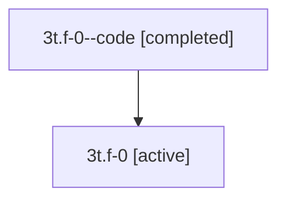

# Family: 3t.f-0

[Agent Hoods](../README.md) / [bbugyi200](../users/bbugyi200/README.md) / [athena](../users/bbugyi200/machines/athena/README.md) / [3t](../users/bbugyi200/machines/athena/hoods/3t/README.md) / 3t.f-0

Owner: `bbugyi200.athena` · Hood: `3t` · Members: 2

## Lineage

The diagram is an optional enhancement; the ordered table below contains the same lineage in accessible text.

| Role | Agent | State | Model / provider | Timing | Commits | Prompt | Chat |
|---|---|---|---|---|---:|---|---|
| code | 3t.f-0--code | completed | gpt-5.5 / codex | 2026-07-09T18:02:07.299105+00:00 | 0 | — | [Chat](../agents/bbugyi200.athena.3t.f-0--code/chat.md) |
| root | 3t.f-0 | active | opus / claude | 2026-07-09T17:51:39.190840+00:00 | [1](../agents/bbugyi200.athena.3t.f-0/README.md#commits) | [Prompt](../agents/bbugyi200.athena.3t.f-0/prompt.md) | [Chat](../agents/bbugyi200.athena.3t.f-0/chat.md) |

## Commits

| Role | Commit | Subject | Committed (UTC) |
|---|---|---|---|
| root | [`600eb4d`](https://github.com/sase-org/sase/commit/600eb4df714eae16beece21919bbd8b210a803b9) | feat(vcs-log): render SASE tags as styled chips | 2026-07-09 18:14:41 |

## Neighbors

| Agent | Relation | State |
|---|---|---|
| [3t](bbugyi200.athena.3t.md) (family · 2) | ancestor | active 1, completed 1 |
| [3t.f-0.f-0](bbugyi200.athena.3t.f-0.f-0.md) (family · 2) | descendant | active 1, completed 1 |
