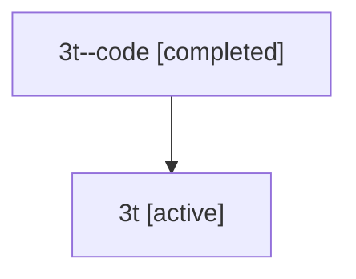

# Family: 3t

[Agent Hoods](../README.md) / [bbugyi200](../users/bbugyi200/README.md) / [athena](../users/bbugyi200/machines/athena/README.md) / [3t](../users/bbugyi200/machines/athena/hoods/3t/README.md) / 3t

Owner: `bbugyi200.athena` · Hood: `3t` · Members: 2

## Lineage

The diagram is an optional enhancement; the ordered table below contains the same lineage in accessible text.

| Role | Agent | State | Model / provider | Timing | Commits | Prompt | Chat |
|---|---|---|---|---|---:|---|---|
| code | 3t--code | completed | gpt-5.5 / codex | 2026-07-09T17:20:19.583912+00:00 | [1](../agents/bbugyi200.athena.3t--code/README.md#commits) | — | [Chat](../agents/bbugyi200.athena.3t--code/chat.md) |
| root | 3t | active | gpt-5.5 / codex | 2026-07-09T17:15:32.158759+00:00 | 0 | [Prompt](../agents/bbugyi200.athena.3t/prompt.md) | [Chat](../agents/bbugyi200.athena.3t/chat.md) |

## Commits

| Role | Repo | Commit | Subject | Committed |
|---|---|---|---|---|
| code | sase | [`6137dba`](https://github.com/sase-org/sase/commit/6137dbafecf1b8e80a8f32f6a0ad57952166a716) | feat(vcs): show SASE tags in log | 2026-07-09 17:33:46 UTC |

## Neighbors

| Agent | Relation | State |
|---|---|---|
| [3t.f-0](bbugyi200.athena.3t.f-0.md) (family · 2) | descendant | active 1, completed 1 |
| [3t.f-0.f-0](bbugyi200.athena.3t.f-0.f-0.md) (family · 2) | descendant | active 1, completed 1 |
