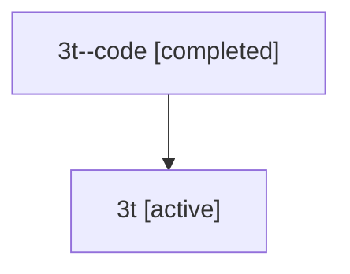

# Family: 3t

Owner: `bbugyi200.athena` · Hood: `3t` · Members: 2

## Lineage

The diagram is an optional enhancement; the ordered table below contains the same lineage in accessible text.

| Role | Agent | State | Model / provider | Timing | Commits | Prompt | Chat |
|---|---|---|---|---|---:|---|---|
| code | 3t--code | completed | gpt-5.5 / codex | 2026-07-09T17:20:19.583912+00:00 | 1 | — | [Chat](../agents/bbugyi200.athena.3t--code/chat.md) |
| root | 3t | active | gpt-5.5 / codex | 2026-07-09T17:15:32.158759+00:00 | 1 | [Prompt](../agents/bbugyi200.athena.3t/prompt.md) | [Chat](../agents/bbugyi200.athena.3t/chat.md) |
