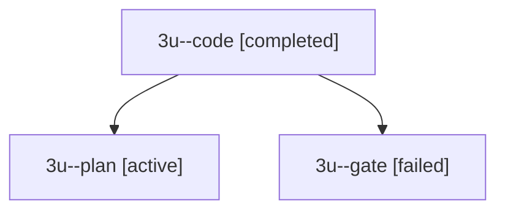

# Family: 3u

[Agent Hoods](../README.md) / [bbugyi200](../users/bbugyi200/README.md) / [athena](../users/bbugyi200/machines/athena/README.md) / [3u](../users/bbugyi200/machines/athena/hoods/3u/README.md) / 3u

Owner: `bbugyi200.athena` · Hood: `3u` · Members: 3

## Lineage

The diagram is an optional enhancement; the ordered table below contains the same lineage in accessible text.

| Role | Agent | State | Model / provider | Timing | Commits | Prompt | Chat |
|---|---|---|---|---|---:|---|---|
| code | 3u--code | completed | grok-4.6 / grok | 2026-09-13T14:56:01.808775+00:00 → 2026-09-13T16:08:55.251519+00:00 | [1](../agents/bbugyi200.athena.3u--code/README.md#commits) | [Prompt](../agents/bbugyi200.athena.3u--code/prompt.md) | [Chat](../agents/bbugyi200.athena.3u--code/chat.md) |
| plan | 3u--plan | active | gpt-6-astra / codex | 2026-09-13T14:11:30.656277+00:00 | 0 | [Prompt](../agents/bbugyi200.athena.3u--plan/prompt.md) | [Chat](../agents/bbugyi200.athena.3u--plan/chat.md) |
| gate | 3u--gate | failed | gpt-6-astra / codex | 2026-09-13T14:50:22.335478+00:00 → 2026-09-13T14:55:32.380077+00:00 | 0 | — | [Chat](../agents/bbugyi200.athena.3u--gate/chat.md) |

## Commits

| Role | Repo | Commit | Subject | Committed |
|---|---|---|---|---|
| — | sase | [`0a47d61`](https://github.com/sase-org/sase/commit/0a47d61a4462bad9b48897826ee2dd1e4ed0288c) | chore: Add SDD prompt and plan for pyvision\_external\_repo\_resolution | 2026-06-08 10:57:07 EDT |
| code | sase | [`eea8af0`](https://github.com/sase-org/sase/commit/eea8af0421796fed2b7458002c7a00eaa5ccccd2) | feat(agent): isolate Cargo build-dir for launched and recipe builds | 2026-09-13 12:04:00 EDT |

## Neighbors

| Agent | Relation | State |
|---|---|---|
| [3u.f1](../agents/bbugyi200.athena.3u.f1/README.md) | descendant | completed |
