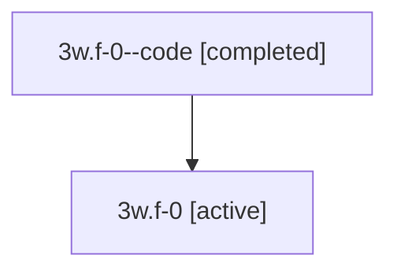

# Family: 3w.f-0

[Agent Hoods](../README.md) / [bbugyi200](../users/bbugyi200/README.md) / [athena](../users/bbugyi200/machines/athena/README.md) / [3w](../users/bbugyi200/machines/athena/hoods/3w/README.md) / 3w.f-0

Owner: `bbugyi200.athena` · Hood: `3w` · Members: 2

## Lineage

The diagram is an optional enhancement; the ordered table below contains the same lineage in accessible text.

| Role | Agent | State | Model / provider | Timing | Commits | Prompt | Chat |
|---|---|---|---|---|---:|---|---|
| code | 3w.f-0--code | completed | gpt-5.5 / codex | 2026-07-09T19:11:48.354005+00:00 | 0 | — | [Chat](../agents/bbugyi200.athena.3w.f-0--code/chat.md) |
| root | 3w.f-0 | active | gpt-5.5 / codex | 2026-07-09T19:08:07.637454+00:00 | [1](../agents/bbugyi200.athena.3w.f-0/README.md#commits) | [Prompt](../agents/bbugyi200.athena.3w.f-0/prompt.md) | [Chat](../agents/bbugyi200.athena.3w.f-0/chat.md) |

## Commits

| Role | Commit | Subject | Committed (UTC) |
|---|---|---|---|
| root | [`f150306`](https://github.com/sase-org/sase/commit/f150306cebf1de284548241316ef51a548877bba) | feat!: remove directory workspace xprompt | 2026-07-09 19:35:52 |

## Neighbors

| Agent | Relation | State |
|---|---|---|
| [3w](bbugyi200.athena.3w.md) (family · 2) | ancestor | active 1, completed 1 |
| [3w.f-0.w-0](../agents/bbugyi200.athena.3w.f-0.w-0/README.md) | descendant | active |
| [3w.f-0.w-1](bbugyi200.athena.3w.f-0.w-1.md) (family · 2) | descendant | active 1, completed 1 |
| [3w.f-0.w-1.f-0](bbugyi200.athena.3w.f-0.w-1.f-0.md) (family · 2) | descendant | active 1, completed 1 |
