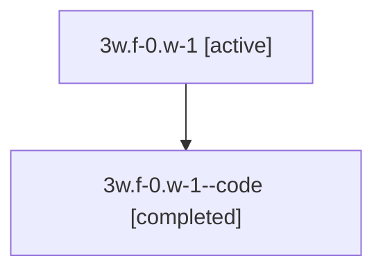

# Family: 3w.f-0.w-1

[Agent Hoods](../README.md) / [bbugyi200](../users/bbugyi200/README.md) / [athena](../users/bbugyi200/machines/athena/README.md) / [3w](../users/bbugyi200/machines/athena/hoods/3w/README.md) / 3w.f-0.w-1

Owner: `bbugyi200.athena` · Hood: `3w` · Members: 2

## Lineage

The diagram is an optional enhancement; the ordered table below contains the same lineage in accessible text.

| Role | Agent | State | Model / provider | Timing | Commits | Prompt | Chat |
|---|---|---|---|---|---:|---|---|
| root | 3w.f-0.w-1 | active | gpt-5.5 / codex | 2026-07-09T19:36:26.350203+00:00 | 0 | [Prompt](../agents/bbugyi200.athena.3w.f-0.w-1/prompt.md) | [Chat](../agents/bbugyi200.athena.3w.f-0.w-1/chat.md) |
| code | 3w.f-0.w-1--code | completed | gpt-5.5 / codex | 2026-07-09T19:40:20.076496+00:00 | [1](../agents/bbugyi200.athena.3w.f-0.w-1--code/README.md#commits) | — | [Chat](../agents/bbugyi200.athena.3w.f-0.w-1--code/chat.md) |

## Commits

| Role | Repo | Commit | Subject | Committed |
|---|---|---|---|---|
| code | sase | [`1815d55`](https://github.com/sase-org/sase/commit/1815d551553a28e69e2b097a034c5c57d8fe1f7a) | feat!: remove legend and myth planning flows | 2026-07-09 16:45:33 EDT |

## Neighbors

| Agent | Relation | State |
|---|---|---|
| [3w.f-0](bbugyi200.athena.3w.f-0.md) (family · 2) | ancestor | active 1, completed 1 |
| [3w](bbugyi200.athena.3w.md) (family · 2) | ancestor | active 1, completed 1 |
| [3w.f-0.w-1.f-0](bbugyi200.athena.3w.f-0.w-1.f-0.md) (family · 2) | descendant | active 1, completed 1 |
| [3w.f-0.w-0](../agents/bbugyi200.athena.3w.f-0.w-0/README.md) | 3w.f-0 hood | active |
