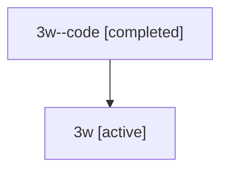

# Family: 3w

Owner: `bbugyi200.athena` · Hood: `3w` · Members: 2

## Lineage

The diagram is an optional enhancement; the ordered table below contains the same lineage in accessible text.

| Role | Agent | State | Model / provider | Timing | Commits | Prompt | Chat |
|---|---|---|---|---|---:|---|---|
| code | 3w--code | completed | gpt-5.5 / codex | 2026-07-09T18:52:25.241644+00:00 | 0 | — | [Chat](../agents/bbugyi200.athena.3w--code/chat.md) |
| root | 3w | active | opus / claude | 2026-07-09T18:43:39.035771+00:00 | 3 | [Prompt](../agents/bbugyi200.athena.3w/prompt.md) | [Chat](../agents/bbugyi200.athena.3w/chat.md) |
