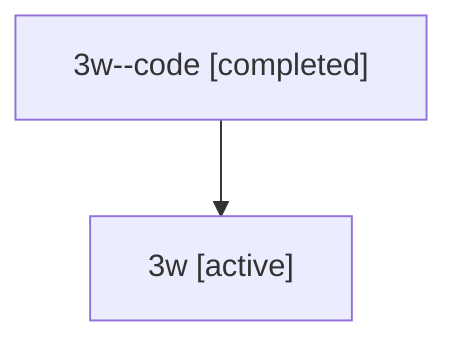

# Family: 3w

[Agent Hoods](../README.md) / [bbugyi200](../users/bbugyi200/README.md) / [athena](../users/bbugyi200/machines/athena/README.md) / [3w](../users/bbugyi200/machines/athena/hoods/3w/README.md) / 3w

Owner: `bbugyi200.athena` · Hood: `3w` · Members: 2

## Lineage

The diagram is an optional enhancement; the ordered table below contains the same lineage in accessible text.

| Role | Agent | State | Model / provider | Timing | Commits | Prompt | Chat |
|---|---|---|---|---|---:|---|---|
| code | 3w--code | completed | gpt-5.5 / codex | 2026-07-09T18:52:25.241644+00:00 | 0 | — | [Chat](../agents/bbugyi200.athena.3w--code/chat.md) |
| root | 3w | active | opus / claude | 2026-07-09T18:43:39.035771+00:00 | [3](../agents/bbugyi200.athena.3w/README.md#commits) | [Prompt](../agents/bbugyi200.athena.3w/prompt.md) | [Chat](../agents/bbugyi200.athena.3w/chat.md) |

## Commits

| Role | Repo | Commit | Subject | Committed |
|---|---|---|---|---|
| root | sase | [`cef8fa2`](https://github.com/sase-org/sase/commit/cef8fa2def2b6ec32aa59e88b0b596d183456083) | chore: Add SDD prompt and plan for automated\_semver\_releases | 2026-06-08 12:29:25 EDT |
| root | sase | [`63f3108`](https://github.com/sase-org/sase/commit/63f310837b5279c7a842e1ebaa05ba982dc5b2eb) | chore: create automated semver release epic beads | 2026-06-08 12:34:59 EDT |
| root | sase | [`2a2d9af`](https://github.com/sase-org/sase/commit/2a2d9afb194e7f83e167df1cd253a916eb11bc67) | docs: add xprompt memory note | 2026-07-09 15:07:32 EDT |

## Neighbors

| Agent | Relation | State |
|---|---|---|
| [3w.f-0](bbugyi200.athena.3w.f-0.md) (family · 2) | descendant | active 1, completed 1 |
| [3w.f-0.w-0](../agents/bbugyi200.athena.3w.f-0.w-0/README.md) | descendant | active |
| [3w.f-0.w-1](bbugyi200.athena.3w.f-0.w-1.md) (family · 2) | descendant | active 1, completed 1 |
| [3w.f-0.w-1.f-0](bbugyi200.athena.3w.f-0.w-1.f-0.md) (family · 2) | descendant | active 1, completed 1 |
