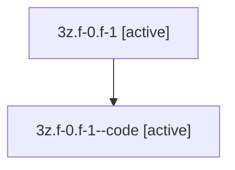

# Family: 3z.f-0.f-1

Owner: `bbugyi200.athena` · Hood: `3z` · Members: 2

## Lineage

The diagram is an optional enhancement; the ordered table below contains the same lineage in accessible text.

| Role | Agent | State | Model / provider | Timing | Commits | Prompt | Chat |
|---|---|---|---|---|---:|---|---|
| root | 3z.f-0.f-1 | active | gpt-5.6-sol / codex | 2026-07-09T23:18:42.322436+00:00 | 0 | [Prompt](../agents/bbugyi200.athena.3z.f-0.f-1/prompt.md) | [Chat](../agents/bbugyi200.athena.3z.f-0.f-1/chat.md) |
| code | 3z.f-0.f-1--code | active | gpt-5.6 / codex | 2026-07-09T23:22:53.076856+00:00 | 0 | — | — |
