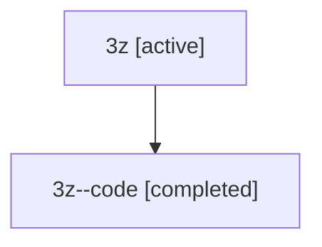

# Family: 3z

[Agent Hoods](../README.md) / [bbugyi200](../users/bbugyi200/README.md) / [athena](../users/bbugyi200/machines/athena/README.md) / [3z](../users/bbugyi200/machines/athena/hoods/3z/README.md) / 3z

Owner: `bbugyi200.athena` · Hood: `3z` · Members: 2

## Lineage

The diagram is an optional enhancement; the ordered table below contains the same lineage in accessible text.

| Role | Agent | State | Model / provider | Timing | Commits | Prompt | Chat |
|---|---|---|---|---|---:|---|---|
| root | 3z | active | gpt-5.5 / codex | 2026-07-09T18:32:32.982412 | [3](../agents/bbugyi200.athena.3z/README.md#commits) | [Prompt](../agents/bbugyi200.athena.3z/prompt.md) | [Chat](../agents/bbugyi200.athena.3z/chat.md) |
| code | 3z--code | completed | gpt-5.5 / codex | 2026-07-09T22:36:02.964541+00:00 | 0 | — | [Chat](../agents/bbugyi200.athena.3z--code/chat.md) |

## Commits

| Role | Repo | Commit | Subject | Committed (UTC) |
|---|---|---|---|---|
| root | sase | [`4d09efd`](https://github.com/sase-org/sase/commit/4d09efd737e53154827139ec436abb3f1e3cce1d) | chore: Add SDD prompt and plan for generalized\_agent\_name\_at\_templates | 2026-06-08 19:02:59 |
| root | sase | [`59f4a61`](https://github.com/sase-org/sase/commit/59f4a6154a84208b0512c6c1baa7212d2b96f877) | chore: create generalized agent name template epic beads | 2026-06-08 19:08:35 |
| root | sase | [`848c812`](https://github.com/sase-org/sase/commit/848c812bb89b63444d9a601fa1c01333ec9c495f) | feat: add gpt-5.6 model support | 2026-07-09 22:57:51 |

## Neighbors

| Agent | Relation | State |
|---|---|---|
| [3z.f-0](../agents/bbugyi200.athena.3z.f-0/README.md) | descendant | active |
| [3z.f-0.f-0](bbugyi200.athena.3z.f-0.f-0.md) (family · 2) | descendant | active 2 |
| [3z.f-0.f-1](bbugyi200.athena.3z.f-0.f-1.md) (family · 2) | descendant | active 2 |
