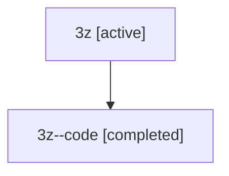

# Family: 3z

Owner: `bbugyi200.athena` · Hood: `3z` · Members: 2

## Lineage

The diagram is an optional enhancement; the ordered table below contains the same lineage in accessible text.

| Role | Agent | State | Model / provider | Timing | Commits | Prompt | Chat |
|---|---|---|---|---|---:|---|---|
| root | 3z | active | gpt-5.5 / codex | 2026-07-09T18:32:32.982412 | 3 | [Prompt](../agents/bbugyi200.athena.3z/prompt.md) | [Chat](../agents/bbugyi200.athena.3z/chat.md) |
| code | 3z--code | completed | gpt-5.5 / codex | 2026-07-09T22:36:02.964541+00:00 | 0 | — | [Chat](../agents/bbugyi200.athena.3z--code/chat.md) |
