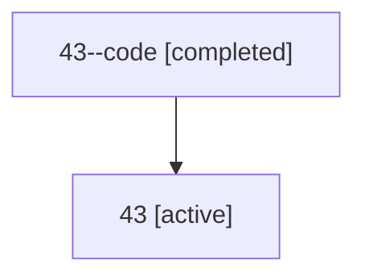

# Family: 43

Owner: `bbugyi200.athena` · Hood: `43` · Members: 2

## Lineage

The diagram is an optional enhancement; the ordered table below contains the same lineage in accessible text.

| Role | Agent | State | Model / provider | Timing | Commits | Prompt | Chat |
|---|---|---|---|---|---:|---|---|
| code | 43--code | completed | gpt-5.6-sol / codex | 2026-07-10T10:47:31.174648+00:00 | 0 | — | [Chat](../agents/bbugyi200.athena.43--code/chat.md) |
| root | 43 | active | gpt-5.6-sol / codex | 2026-07-09T23:51:48.856187+00:00 | 2 | [Prompt](../agents/bbugyi200.athena.43/prompt.md) | [Chat](../agents/bbugyi200.athena.43/chat.md) |
