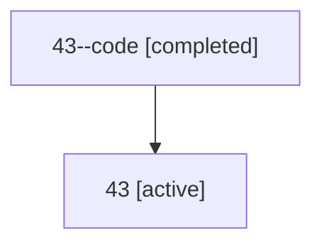

# Family: 43

[Agent Hoods](../README.md) / [bbugyi200](../users/bbugyi200/README.md) / [athena](../users/bbugyi200/machines/athena/README.md) / [43](../users/bbugyi200/machines/athena/hoods/43/README.md) / 43

Owner: `bbugyi200.athena` · Hood: `43` · Members: 2

## Lineage

The diagram is an optional enhancement; the ordered table below contains the same lineage in accessible text.

| Role | Agent | State | Model / provider | Timing | Commits | Prompt | Chat |
|---|---|---|---|---|---:|---|---|
| code | 43--code | completed | gpt-5.6-sol / codex | 2026-07-10T10:47:31.174648+00:00 | 0 | — | [Chat](../agents/bbugyi200.athena.43--code/chat.md) |
| root | 43 | active | gpt-5.6-sol / codex | 2026-07-09T23:51:48.856187+00:00 | [2](../agents/bbugyi200.athena.43/README.md#commits) | [Prompt](../agents/bbugyi200.athena.43/prompt.md) | [Chat](../agents/bbugyi200.athena.43/chat.md) |

## Commits

| Role | Repo | Commit | Subject | Committed |
|---|---|---|---|---|
| root | sase | [`22b5102`](https://github.com/sase-org/sase/commit/22b5102511e10937af3dfb7ae18bd1cd31fdd8da) | chore: Add SDD prompt and plan for sase\_core\_rs\_pypi\_release\_recovery | 2026-06-09 08:01:19 EDT |
| root | sase | [`747d9be`](https://github.com/sase-org/sase/commit/747d9be322fda3d635d436217365084031d12188) | feat(sdd)!: make provider storage authoritative | 2026-07-10 07:47:30 EDT |

## Neighbors

| Agent | Relation | State |
|---|---|---|
| [43.f1](../agents/bbugyi200.athena.43.f1/README.md) | descendant | completed |
| [43.f1.f1](../agents/bbugyi200.athena.43.f1.f1/README.md) | descendant | completed |
| [43.f1.f1.f1.cld.f1](../agents/bbugyi200.athena.43.f1.f1.f1.cld.f1/README.md) | descendant | completed |
| [43.f1.f1.f1.cld.f1.f1.cdx.f1.cld](../agents/bbugyi200.athena.43.f1.f1.f1.cld.f1.f1.cdx.f1.cld/README.md) | descendant | completed |
