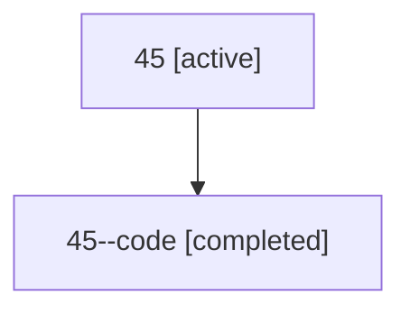

# Family: 45

[Agent Hoods](../README.md) / [bbugyi200](../users/bbugyi200/README.md) / [athena](../users/bbugyi200/machines/athena/README.md) / [45](../users/bbugyi200/machines/athena/hoods/45/README.md) / 45

Owner: `bbugyi200.athena` · Hood: `45` · Members: 2

## Lineage

The diagram is an optional enhancement; the ordered table below contains the same lineage in accessible text.

| Role | Agent | State | Model / provider | Timing | Commits | Prompt | Chat |
|---|---|---|---|---|---:|---|---|
| root | 45 | active | gpt-5.6-sol / codex | 2026-07-10T13:30:23.728004+00:00 | [1](../agents/bbugyi200.athena.45/README.md#commits) | [Prompt](../agents/bbugyi200.athena.45/prompt.md) | [Chat](../agents/bbugyi200.athena.45/chat.md) |
| code | 45--code | completed | gpt-5.6-sol / codex | 2026-07-10T13:34:37.046003+00:00 | 0 | — | [Chat](../agents/bbugyi200.athena.45--code/chat.md) |

## Commits

| Role | Repo | Commit | Subject | Committed (UTC) |
|---|---|---|---|---|
| root | sase | [`6b5feab`](https://github.com/sase-org/sase/commit/6b5feab699582c88e198ff53170847c736198203) | test(sdd-store): isolate git commit identity | 2026-07-10 13:38:46 |
