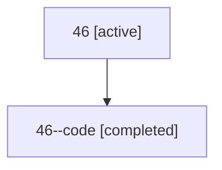

# Family: 46

Owner: `bbugyi200.athena` · Hood: `46` · Members: 2

## Lineage

The diagram is an optional enhancement; the ordered table below contains the same lineage in accessible text.

| Role | Agent | State | Model / provider | Timing | Commits | Prompt | Chat |
|---|---|---|---|---|---:|---|---|
| root | 46 | active | opus / claude | 2026-07-10T13:48:20.204342+00:00 | 1 | [Prompt](../agents/bbugyi200.athena.46/prompt.md) | [Chat](../agents/bbugyi200.athena.46/chat.md) |
| code | 46--code | completed | gpt-5.6-sol / codex | 2026-07-10T13:56:40.274864+00:00 | 0 | — | [Chat](../agents/bbugyi200.athena.46--code/chat.md) |
