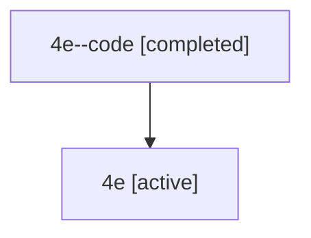

# Family: 4e

[Agent Hoods](../README.md) / [bbugyi200](../users/bbugyi200/README.md) / [athena](../users/bbugyi200/machines/athena/README.md) / [4e](../users/bbugyi200/machines/athena/hoods/4e/README.md) / 4e

Owner: `bbugyi200.athena` · Hood: `4e` · Members: 2

## Lineage

The diagram is an optional enhancement; the ordered table below contains the same lineage in accessible text.

| Role | Agent | State | Model / provider | Timing | Commits | Prompt | Chat |
|---|---|---|---|---|---:|---|---|
| code | 4e--code | completed | gpt-5.6-sol / codex | 2026-07-10T14:33:26.858112+00:00 | [1](../agents/bbugyi200.athena.4e--code/README.md#commits) | — | [Chat](../agents/bbugyi200.athena.4e--code/chat.md) |
| root | 4e | active | gpt-5.6-sol / codex | 2026-07-10T14:29:45.362571+00:00 | 0 | [Prompt](../agents/bbugyi200.athena.4e/prompt.md) | [Chat](../agents/bbugyi200.athena.4e/chat.md) |

## Commits

| Role | Repo | Commit | Subject | Committed |
|---|---|---|---|---|
| — | sase | [`40696be`](https://github.com/sase-org/sase/commit/40696be4f10668e74588d1dc16e59a29831d9155) | chore: Add SDD prompt and plan for github\_ci\_sase\_version\_skew | 2026-06-09 19:53:48 UTC |
| code | sase | [`22d3906`](https://github.com/sase-org/sase/commit/22d3906155cf97804938ddc70beb55168009ce6b) | fix(notifications): limit completion image attachments | 2026-07-10 14:40:46 UTC |
