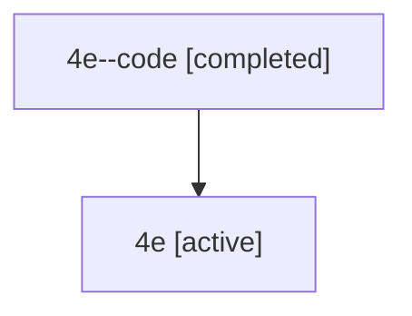

# Family: 4e

Owner: `bbugyi200.athena` · Hood: `4e` · Members: 2

## Lineage

The diagram is an optional enhancement; the ordered table below contains the same lineage in accessible text.

| Role | Agent | State | Model / provider | Timing | Commits | Prompt | Chat |
|---|---|---|---|---|---:|---|---|
| code | 4e--code | completed | gpt-5.6-sol / codex | 2026-07-10T14:33:26.858112+00:00 | 0 | — | [Chat](../agents/bbugyi200.athena.4e--code/chat.md) |
| root | 4e | active | gpt-5.6-sol / codex | 2026-07-10T14:29:45.362571+00:00 | 2 | [Prompt](../agents/bbugyi200.athena.4e/prompt.md) | [Chat](../agents/bbugyi200.athena.4e/chat.md) |
