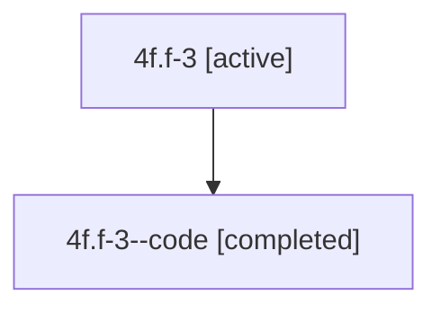

# Family: 4f.f-3

Owner: `bbugyi200.athena` · Hood: `4f` · Members: 2

## Lineage

The diagram is an optional enhancement; the ordered table below contains the same lineage in accessible text.

| Role | Agent | State | Model / provider | Timing | Commits | Prompt | Chat |
|---|---|---|---|---|---:|---|---|
| root | 4f.f-3 | active | claude-fable-5 / claude | 2026-07-10T16:49:08.605060+00:00 | 1 | [Prompt](../agents/bbugyi200.athena.4f.f-3/prompt.md) | [Chat](../agents/bbugyi200.athena.4f.f-3/chat.md) |
| code | 4f.f-3--code | completed | gpt-5.6-sol / codex | 2026-07-10T16:59:33.146105+00:00 | 0 | — | [Chat](../agents/bbugyi200.athena.4f.f-3--code/chat.md) |
